# 🚗 Modüler Trafik İzleme ve Araç Sayım Sistemi


Derin öğrenme modelleri öncesinde güçlü bir referans (baseline) oluşturmak amacıyla, **Model-View-Presenter (MVP)** tasarım kalıbı kullanılarak geliştirilmiş klasik Bilgisayarlı Görü (Computer Vision) projesidir. Gerçek zamanlı araç tespiti, otomatik ROI kalibrasyonu ve çizgi bazlı araç sayımı yapar.


---

## 📌 Proje Hakkında

Bu proje, harici yapay zeka modelleri ve GPU bağımlılığı olmadan yalnızca klasik bilgisayarlı görü teknikleri ve matematiksel filtreler kullanarak karmaşık bir gerçek zamanlı video işleme sisteminin nasıl kurgulanacağını gösterir. 

Işık değişimleri, araç gölgeleri, rüzgar gürültüsü ve harici alan müdahaleleri gibi gerçek dünya problemlerini çözmek için özel kalibrasyon ve filtreleme mimarileri içerir.

---

# 🏗️️ Sistem Mimarisi, Algoritmalar ve Teknik Metotlar

Bu proje, harici bir derin öğrenme modeli veya GPU bağımlılığı gerektirmeksizin; yüksek başarımlı nesne tespiti, otonom alan izolasyonu ve gerçek zamanlı çift yönlü araç sayımı gerçekleştirmek üzere tasarlanmış uçtan uca bir bilgisayarlı görü (computer vision) sistemidir.

```mermaid
flowchart LR
    A[Video Frame] --> B[Preprocessor: Gaussian Blur & MOG2]
    B --> C{config.AUTO_ROI_ENABLED?}
    C -- True --> D[AutoROIGenerator: Accumulate Motion & Build Heatmap]
    D --> E{Is Calibrated?}
    E -- No --> F[Update Accumulator & Return Uncalibrated Mask]
    E -- Yes --> G[Finalize Calibration: Normalize, Threshold, Hull & fillPoly]
    C -- False --> H[Create Manual ROI via ROI_HANDLE_VALUES & fillPoly]
    G --> I[RoiManager: Lock Mask & Apply via bitwise_and]
    H --> I
    I --> J[VehicleDetector: findContours & Morphology]
    J --> K[Contour Area Filter & BoundingRect Extraction]
    K --> L[TrafficCounter: Calculate Centers Cx, Cy]
    L --> M[Nearest Neighbor Matching: Euclidean Distance]
    M --> N{Line Crossing Check: Bi-directional Sign Change}
    N -- Crossed --> O[Increment vehicle_count & Mark is_counted = True]
    N -- Not Crossed --> P[Update tracked_objects Memory & missed_frames]
    O --> P
    P --> Q[UI Dashboard: Draw Bounding Boxes, IDs & Stats Panel]

```




---

## 1. Mimari Tasarım & Katmanlar

Yazılım mühendisliğinde sürdürülebilirlik ve ölçeklenebilirlik sağlamak amacıyla proje, **Modüler Mimari** ve **Sorumlulukların Ayrılması (Separation of Concerns)** prensiplerine uygun olarak katmanlandırılmıştır. Kod tabanı tek bir dosyaya yığılmak yerine işlevsel alt modüllere ayrılmıştır:

* **Sunum ve Arayüz Katmanı (`main.py`):**
  * Video akışının okunduğu ve modüller arası verinin koordine edildiği ana yönetim döngüsüdür (orchestrator).
  * OpenCV penceresi üzerinde yan yana akış birleştirme (`np.hstack`), nesne kutulama, ID etiketleme ile modern alt bilgi paneli (Dashboard/HUD) çizimlerini üstlenir.

* **İş Mantığı ve Takip Katmanı (`tracking/`):**
  * **`RoiManager.py`:** Kalibrasyon sürecini yöneten veya manuel ROI maskesini anında kilitleyen bileşendir.
  * **`VehicleDetector.py`:** Temizlenmiş ön plan maskesi üzerinde kontur analizi yaparak gürültüleri eleyen ve araçları sınırlayıcı kutulara (Bounding Box) dönüştüren bileşendir.
  * **`TrafficCounter.py`:** Araçların merkez noktalarını takip eden, Öklid mesafesiyle kareler arası nesne eşleştiren (Nearest Neighbor) ve yön bağımsız çift yönlü çizgi geçiş sayımını gerçekleştiren motordur.

* **Temel Görüntü İşleme Katmanı (`core/`):**
  * **`Preprocessor.py`:** Gri tonlama, Gaussian Blur ve MOG2 arka plan çıkarımı adımlarını koordine eden görüntü işleme boru hattıdır (pipeline).
  * **`AutoROIGenerator.py`:** İlk $N$ kare boyunca hareketli pikselleri logaritmik olarak biriktirerek ısı haritası ve dışbükey örtü (Convex Hull) yöntemiyle otonom yol bölgesi çıkaran bileşendir.

* **Konfigürasyon Katmanı (`config.py`):**
  * Tüm hiperparametrelerin (MOG2 hassasiyeti, kernel boyutları, kalibrasyon kare limiti, eşik değerleri) tek bir merkezden yönetildiği konfigürasyon dosyasıdır.

---

## 2. Kullanılan Algoritmalar ve Teknik Envanter Tablosu

| İşlem Adımı | Kullanılan Algoritma / Metot | Teknik Amacı & Problemi Çözme Şekli |
| :--- | :--- | :--- |
| **Görüntü Yumuşatma** | **Gaussian Blur** | Yüksek frekanslı pikselsel gürültüleri (kamera senkronizasyon kaymaları, ince detaylar) bastırarak arka plan çıkarma algoritmasının kararlılığını artırır. |
| **Arka Plan Çıkarma** | **MOG2** *(Mixture of Gaussians)* | Her pikseli adaptif Gauss dağılımları ile modeller. Dış mekan ışık değişimlerine uyum sağlayarak hareketli ön plan nesnelerini (foreground) dinamik olarak ayıklar. |
| **Otonom Yol İzolasyonu** | **Logaritmik Isı Haritası & Convex Hull** | Hareketli piksel yoğunluklarını logaritmik olarak biriktirerek ısı haritası oluşturur. En dış sınırları Dışbükey Örtü (Convex Hull) ile birleştirip otonom yol maskesi üretir. |
| **ROI Kilitleme** | **Mantıksal VE Operasyonu** *(cv2.bitwise_and)* | Kilitlenen otonom ROI maskesi ile yol dışındaki ağaçlar, binalar ve ilgisiz alanlardaki hareketleri kör eder. Yanlış tespiti (false positive) engeller. |
| **Gürültü Temizleme** | **Morfolojik Açma / Kapama** *(Erosion & Dilation)* | MOG2 çıktısındaki pikselsel parazitleri erozyon ile siler, araç gövdelerindeki boşlukları ve kopuklukları genişletme (dilation) ile birleştirir. |
| **Nesne Tespiti** | **Kontur Filtreleme & Bounding Box** | İkili görüntüdeki süreklilik gösteren piksel kümelerini yakalar. Min/Max alan eşikleriyle yaprak, kuş veya gürültüleri eler; araçları $x, y, w, h$ kutularına dönüştürür. |
| **Kareler Arası Eşleştirme** | **Öklid Mesafesi & En Yakın Komşu** *(Nearest Neighbor)* | Mevcut karedeki araç merkezleri ile bir önceki karedeki araç merkezleri arasındaki mesafeyi hesaplayarak araç ID'lerini kareler boyunca kesintisiz takip eder. |
| **Çift Yönlü Sayım** | **Yön Bağımsız Çizgi Geçiş Matematiği** | Araç merkezlerinin sanal $Y_{\text{çizgi}}$ sınırından vektörel geçiş yönünü doğrulayarak hem geliş hem gidiş yönlü araç sayımını tekrarsız gerçekleştirir. |

---
## 📂 Proje Dizin Yapısı

```text
opencv-traffic-monitoring-system/
│
├── core/                   # Temel Görüntü İşleme & Maskeleme
│   ├── Preprocessor.py     # Gaussian Blur & MOG2 Pipeline
│   └── AutoROIGenerator.py # Isı Haritası & Convex Hull Kalibratörü
│
├── tracking/               # Takip & İş Mantığı Modülleri
│   ├── RoiManager.py       # ROI Kilit ve Maske Yönetimi
│   ├── VehicleDetector.py  # Kontur Analizi & Bounding Box Tespiti
│   └── TrafficCounter.py   # Öklid Takibi & Çift Yönlü Sayım Motoru
│
├── config.py               # Hiperparametreler ve Sistem Eşikleri
└── main.py                 # Presenter & UI Dashboard Yönetim 
```
